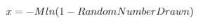
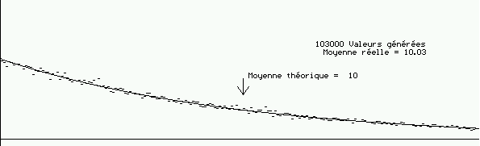
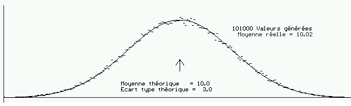
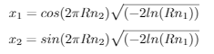

# <center> Simulation TP2<br>Génération de variables aléatoires<br> <span style=font-size:20px> Arquillière Mathieu</span> </center>

## 1 - Mastsumoto
Dans ce TP, on utilise l'implémentation en C du générateur aléatoire *Mersenne Twister* ([MT](http://www.math.sci.hiroshima-u.ac.jp/~m-mat/MT/MT2002/emt19937ar.html "MT by M.Matsumoto")) du professeur __Makoto Matsumoto__.  
En utilisant son implémentation, on a plusieurs possibilités d'obtenir des nombres aléatoires (extrait du __readme__):
>genrand_int32() generates unsigned 32-bit integers.<br>
genrand_int31() generates unsigned 31-bit integers.<br>
genrand_real1() generates uniform real in [0,1] (32-bit resolution).<br>
genrand_real2() generates uniform real in [0,1) (32-bit resolution).<br>
genrand_real3() generates uniform real in (0,1) (32-bit resolution).<br>
genrand_res53() generates uniform real in [0,1) with 53-bit resolution.

On vérifie que la sortie du programme donné correspond bien à la sortie attendue fournie par M. Matsumoto.

## 2 - Génération uniforme
Pour "encadrer" un nombre entre deux bornes, il suffit d'utiliser un petite formule. On utilise donc la fonction __genrand_real1()__ pour obtenir un nombre aléatoire et la fonction s'occupe de retourner un nombre correspondant dans l'interval [a,b] donné.

```c
/* Genere un reel entre a et b */
double uniform(double a, double b)
{
    return (genrand_real1() * (b - a)) + a;
}
```

## 3 - Reproduction d'une distribution empirique discrète
Ici l'objectif est de reproduire un histogramme contenant les individus répartis selon des probabilités de classe. Dans l'exemple, il y a 3 classes A, B et C avec leur probabilité respective 0.5, 0.1 et 0.4.
La fonction s'occupe donc de générer le nombre d'individus voulu et grâce à la fonction __genrand_real1()__ décide de placer chaque individu dans une des classe.
```c
void simulatePopulation(int* numberOfPersons, int numberOfIterations)
{
    int i;
    double fgen;

    for(i = 0; i < numberOfIterations; i++)
    {
        fgen = genrand_real1();
        if(fgen < 0.5)
            numberOfPersons[0]++;
        else if(fgen < 0.6)
            numberOfPersons[1]++;
        else
            numberOfPersons[2]++;
    }
}
```
Cependant la fonction ne fonctionne que pour cet exemple, on peut donc créer une fonction plus généraliste qui s'occupera de différent scénarios :
```c
/* Genere a partir d'un tableau de probabilites cumulees un tableau contenant le nombre d'individu dans chaque classe et
un tableau contenant le pourcentage d'individus dans chaque classe */
void simulatePopulation(double* cumulatedProbabilities, int* numberOfPersons, int numberOfIterations)
{
    int i, j;
    double fgen;

    for (i = 0; i < numberOfIterations; i++)
    {
        // Generation du nombre aleatoire entre 0 et 1
        fgen = genrand_real1();

        // Determination de la classe du nombre genere
        j = 0;
        while (fgen >= cumulatedProbabilities[j])
            j++;
        numberOfPersons[j]++;
    }
}
```
Il faut également créer une fonction faisant le raisonnement inverse, on lui donne le nombre d'individus dans chaque classe et elle nous renvoie les probabilités et les probabilités cumulées.
```c
/* Genere a partir d'un tableau de nombre d'individus par classe un tableau contenant les probabilites de chaque classe et
un tableau contenant les probabilites cumulees */
void classProbabilities(int numberOfClasses, int* numberOfPersons, double* probabilities, double* cumulatedProbabilities)
{
    int i, total = 0;

    // Calcul du nombre total d'individu
    for (i = 0; i < numberOfClasses; i++)
        total += numberOfPersons[i];

    if (numberOfClasses > 0)
    {
        // Calcul des probabilites et des probabilites cumulees de chaque classe
        probabilities[0] = (double)numberOfPersons[0] / total;
        cumulatedProbabilities[0] = probabilities[0];
        for (i = 1; i < numberOfClasses; i++)
        {
            probabilities[i] = (double)numberOfPersons[i] / total;
            cumulatedProbabilities[i] = cumulatedProbabilities[i - 1] + probabilities[i];
        }
    }
}
```

## 4 - Reproduction de distributions continues
Cette fois, l'objectif est de reproduire une loi exponentielle négative et d'en observer les résultats. Pour cela on reproduit la formule donnée :  
  
On en déduit la fonction correspondante :
```c
/* Genere un nombre aleatoire selon un distribution negative exponentielle */
double nexp(double m)
{
    return -m * log(1 - genrand_real1());
}
```
Ensuite on regarde si avec un certain nombre de tirages (en l'occurence 1 000 000) on obtient bien la forme de fonction voulue (tests avec M = 10) :
```
Generation nexp
00: 9.5584 %
01: 8.6786 %
02: 7.7673 %
03: 7.0671 %
04: 6.3850 %
05: 5.7710 %
06: 5.1805 %
07: 4.7407 %
08: 4.2596 %
09: 3.8680 %
10: 3.4835 %
11: 3.1604 %
12: 2.8506 %
13: 2.5773 %
14: 2.3251 %
15: 2.1276 %
16: 1.9243 %
17: 1.7415 %
18: 1.5809 %
19: 1.4268 %
```
Cela correspond en effet à une courbe de la forme :


Afin de réaliser ces résultats et ceux de la partie suivante, il a été utile de coder une fonction nous permettant d'avoir le pourcentage représentant la répartition des points tirés aléatoirement sur un certain intervalle.
```c
/* Genere a partir d'un tableau de nombre d'individus un tableau contenant le pourcentage de chaque classe */
void getpercentage(int numberOfFrequencies, int numberOfIterations, int* frequencies, double* percentage)
{
    int i;
    for (i = 0; i < numberOfFrequencies; i++)
    {
        percentage[i] = (double) frequencies[i] / numberOfIterations * 100;
    }   
}
```

## 5 - Simulation de loi de distribution non réversible
Dans cette partie, nous allons nous intéresser au cas d'une distribution de Gausse.


Pour simuler une loi gaussienne centrée réduite, on va utiliser __Box and Muller__. On génere 2 nombres aléatoires _Rn1_ et _Rn2_ grâce à la fonction __genrand_real1()__ et on applique les formules suivantes :  
  
Ca nous done la fonction suivante :
```c
/* Genere 2 nombres aleatoires avec la methode Box and Muller pour suivre une distribution gaussienne centree reduite */
void BoxAndMuller(double* x1, double* x2)
{
    double Rn1 = genrand_real1();
    double Rn2 = genrand_real1();

    *x1 = cos(2 * M_PI * Rn2) * sqrt(-2 * log(Rn1));
    *x2 = sin(2 * M_PI * Rn2) * sqrt(-2 * log(Rn1));
}
```
On observe bien un "comportement gaussien" (centrée réduite) avec les résultats (sur 1 000 000 de tirages) :
```
Box And Muller
-3: 0.1298 %
-2: 2.1394 %
-1: 13.5812 %
00: 68.2820 %
01: 13.5907 %
02: 2.1381 %
03: 0.1330 %
```
On peut simuler une distribution gaussienne non centrée réduite en faisant l'opération inverse de lorsqu'on la centre réduit. En effet si X suit une loi normale centrée réduite, alors Z = X - u / s suit une loi normale d'espérance u et d'écart-type s.
Donc si on fait le raisonnement inverse, on peut écrire la fonction :
```c
/* Utilise Box and Muller pour générer deux nombres suivant une distribution gaussienne avec une esperance et un ecart-type */
void gaussianDist(double mean, double sdDev, double* x1, double* x2)
{
    double centredReducedX1, centredReducedX2;
    
    BoxAndMuller(&centredReducedX1, &centredReducedX2);
    *x1 = sdDev * centredReducedX1 + mean;
    *x2 = sdDev * centredReducedX2 + mean;
}
```
<br><br>
Ainsi on peut obtenir par exemple une distribution avec une espérance de 10 et un écart-type de 3 :
```
Gausse M=10, sdDev=3
00: 0.1227 %
01: 0.2481 %
02: 0.5984 %
03: 1.2935 %
04: 2.5041 %
05: 4.3411 %
06: 6.7441 %
07: 9.3848 %
08: 11.6946 %
09: 13.0563 %
10: 13.0559 %
11: 11.6948 %
12: 9.3837 %
13: 6.7442 %
14: 4.3429 %
15: 2.5038 %
16: 1.2936 %
17: 0.5983 %
18: 0.2479 %
19: 0.0921 %
```

## 6 - Bibliothèques de génération de nombres aléatoires
### C++
La bibliothèque standard en c++ contient beaucoup d'outils afin de générer des nombres aléatoires de différentes façons : [\<random>](http://www.cplusplus.com/reference/random/). Par exemple il y a :  
[Distribution Uniforme](http://www.cplusplus.com/reference/random/uniform_real_distribution/)  
[Distribution Exponentielle](http://www.cplusplus.com/reference/random/exponential_distribution/)  
[Distribution Gaussienne](http://www.cplusplus.com/reference/random/normal_distribution/)  
et bien d'autres ...  
Et tout ça en utilisant en ayant la possibilité d'utiliser différents générateurs de nombres pseudo-aléatoires dont par exemple [Mersenne Twister 19937](http://www.cplusplus.com/reference/random/mt19937/).
### Java
La bibliothèque [Random](https://docs.oracle.com/javase/8/docs/api/java/util/Random.html) en Java existe aussi :  
[Distribution Uniforme](https://docs.oracle.com/javase/8/docs/api/java/util/Random.html#doubles-double-double-)  
[Distribution Gaussienne](https://docs.oracle.com/javase/8/docs/api/java/util/Random.html#nextGaussian--) (utilisant Box and Muller)

## Annexe - Le programme réalisé
Tout le contenu du programme réalisé se trouve dans le fichier __mt19937ar.c__ , où on a completé le programme de M. Matsumoto avec les fonctions demandées. La fonction main s'occupe de réaliser des tests sur les fonctions ajoutées. Le programme a été compilé avec gcc :
<br><br>
```
gcc -o test mt19937ar.c -lm -Wall -Wextra
```
Et exécuter de la manière suivante :
```
./test
```